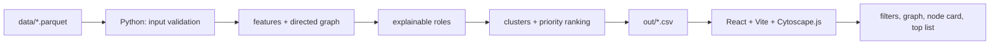

# HackAlem AI — «Граф денег» (TayMas Solutions)

Пайплайн для AML-аналитика: по графу внутрибанковских переводов от 81 seed-клиента он присваивает каждому из 2 248 узлов объяснимую роль, кластер и приоритет проверки. Выводы в выгрузках — это гипотезы для проверки, а не утверждения о виновности.

## Первый запуск

Нужен Python 3.11+. Проверены Python 3.11 и 3.13; команды выполняются из корня репозитория:

```bash
python3 -m venv .venv
source .venv/bin/activate          # Windows: .venv\Scripts\activate
pip install -r requirements.txt
python -m money_graph --data data --out out
```

Полный прогон занимает около 3 секунд на текущей машине. В `out/` появятся `nodes_roles.csv`, `clusters.csv` и `top_nodes.csv`, вспомогательная таблица рёбер `edge_table.csv` и отчёт о прогоне `run_report.md` / `run_report.json`. До расчётов пайплайн проверяет контракт входных данных, перед записью — схему выгрузок и аудит топ-листа (27 проверок).

Для локального Docker-запуска пайплайна и React-интерфейса см. [инструкцию по деплою](docs/deployment.md): `docker compose up --build` поднимает UI на `http://127.0.0.1:8501` и монтирует `data/`/`out/` с хоста.

Чтобы заодно проверить воспроизводимость, добавьте `--check-repro`: пайплайн прогонится второй раз и сверит sha256 всех выгрузок.

```bash
python -m money_graph --data data --out out --check-repro
```

Коды выхода: `0` — OK, `2` — вход не прошёл проверку, `3` — выгрузки не прошли проверку, `4` — повторный прогон дал другие файлы.

Оригинальный стартовый код организаторов сохранён без изменений в `starter/` (`python starter/starter.py --data ./data --out ./out`). Роли, кластеры и приоритеты он оставляет пустыми.

## Данные

В репозиторий данные не коммитятся: архив организаторов нужно распаковать в `./data`. Там должны лежать:

- `nodes.parquet` — 2 248 уникальных узлов;
- `edges.parquet` — 3 119 агрегированных направленных рёбер;
- `transactions.parquet` — 4 840 отдельных транзакций.

Схема полей описана в [docs/DATA_README.md](docs/DATA_README.md) и `starter/README.md`.

Перед расчётом вход проверяется: обязательные колонки, типы, пропуски, дубликаты `gid` и пар, покрытие gid, домены значений, сверка `edges` с `transactions` по суммам и числу переводов. При нарушении прогон останавливается со списком всех проблем (код выхода 2). Особенности выгрузки, например 97 повторяющихся транзакций или 444 узла 4-го колена, выводятся как предупреждения. Правила проверок, единицы измерения, обработка пустых потоков и колонки `edge_table.csv` описаны в [docs/features.md](docs/features.md).

## Устройство

Опциональный AML Copilot (PAN-46): [контракт, локальный режим и NVIDIA adapter](docs/agent_orchestrator.md).
Использует graph tools PAN-45 и verifier PAN-47. Основной пайплайн от него не зависит.

Панель помощника в React (PAN-48): [запуск, проверка фактов и демо на 90 секунд](docs/copilot_panel.md).
Docker Compose запускает локальный API автоматически; для Vite отдельно выполните
`python -m agent_orchestrator.server --out out`. NVIDIA для локальных ответов не нужна.

```
money_graph/          основной пайплайн: python -m money_graph
  config.py           пороги признаков и ролей с обоснованием
  io.py               загрузка parquet и проверка контракта входных данных
  graph.py            таблица направленных рёбер и nx.DiGraph, включая узлы без рёбер
  features.py         признаки узлов
  roles.py            правила ролей, role_score, evidence
  ranking.py          подключение analytics: кластеры, priority_score, top_nodes и их аудит
  outputs.py          схема выгрузок и её проверка
  pipeline.py         прогон целиком в памяти: таблицы, байты CSV, время по этапам
  report.py           отчёт о прогоне: время, sha256 выгрузок, роли, проверки
  cli.py              точка входа
analytics/
  clustering.py       кластеризация и clusters.csv (PAN-35), см. docs/clustering.md
  priority.py         priority_score и why по формуле (PAN-36), см. docs/priority.md
  top_nodes.py        top_nodes.csv и аудит согласованности (PAN-37), см. docs/top_nodes.md
agent_tools/          read-only инструменты графа для AI-ассистента (PAN-45), см. docs/agent_tools.md
  verifier.py         проверка ответа агента по CSV; evaluation.py — 5 контрольных вопросов (PAN-47)
tests/                python -m pytest tests (входной контракт, smoke пайплайна, кластеры, приоритет, топ)
starter/              исходный стартовый код организаторов
```

## Воспроизводимость и время

Каждый прогон пишет `out/run_report.md`. Там время по этапам, sha256 каждой выгрузки, распределение ролей, все пройденные проверки и версии библиотек. Снимок с прогона `--check-repro` после PAN-60 (23 сентября 2026, macOS ARM64, Python 3.11.16, networkx 3.6.1):

| Этап | Секунд |
|---|---:|
| загрузка и проверка входа | 0.09 |
| таблица рёбер и граф | 0.02 |
| признаки узлов (betweenness, HITS, циклы, время) | 1.61 |
| роли и evidence | 0.02 |
| кластеры (Louvain + устойчивость) | 0.66 |
| приоритет и топ-лист | 0.03 |
| сборка и проверка выгрузок | 0.07 |
| **итого** | **2.50** |

Лимит ТЗ — 300 с, запас примерно в 120 раз. Повторный прогон (2.35 с) побайтно совпал по всем четырём CSV. Детерминизм обеспечивается так:
- узлы и рёбра добавляются в граф в отсортированном порядке;
- betweenness считается точно, без сэмплирования;
- HITS считается степенным методом с фиксированным стартом, потому что `nx.hits` в networkx 3.6 использует случайный стартовый вектор;
- у Louvain фиксированный `seed`;
- float округляются до 6 знаков;
- CSV пишутся с переводом строки LF (`\n`) на любой ОС.

sha256 гарантированно совпадает между запусками на одном окружении. На другой ОС или с другими версиями библиотек последние знаки float могут отличаться, поэтому окружение записывается в отчёт.

Smoke-проверки в `tests/test_pipeline.py`:
- сквозной прогон CLI;
- два запуска дают одинаковые файлы;
- CSV после чтения с диска проходят контракт;
- при ошибке входа выход с кодом 2 и ничего не записывается;
- для каждой проверки выгрузок есть тест, который её ломает и убеждается, что поломка поймана;
- на реальном датасете: 2 248 строк, повторяемость и время меньше лимита.

## Признаки узла

| Группа | Колонки | Зачем |
|---|---|---|
| Базовые (starter) | `in_deg, out_deg, in_kzt, out_kzt, in_tx, out_tx, pagerank, pass_through` | потоки: сумма и число переводов считаются отдельно |
| Контрагенты | `n_payers, n_receivers, n_seed_payers, n_seed_receivers, top_payer_share, top_receiver_share, avg_in_tx_kzt, avg_out_tx_kzt` | сколько уникальных сторон, сколько из них seed, насколько поток сосредоточен на одном контрагенте, средний чек |
| Центральность (направленный граф) | `betweenness, hub_score, authority_score, downstream_reach, n_seed_upstream, wcc_id, wcc_size` | через кого идут деньги, кто рассылает, кто собирает, сколько узлов ниже по потоку |
| Граница обхода | `boundary, boundary_depth4, out_observable, in_underestimated, truncated_by_depth, external_inflow_suspected, pass_through_reliable` | какие потоки узла вообще видны в выгрузке |
| Время | `fast_out_share, median_lag_days, sync_payers_max, max_tx_per_day, active_days` | сквозной транзит за ≤2 дня, синхронные поступления, всплески |
| Возвратные потоки | `n_cycles, min_cycle_len, has_long_cycle` | простые направленные циклы длиной до 5 (всего 468); отдельный флаг наличия цикла длиной 3–5 |

### Как учтены ловушки данных

1. **Обрыв на 4-м колене.** Рёбра 4-го колена выходят из узлов depth=3. Поэтому у узлов depth≤3 исходящие выгружены полностью и `out_deg = 0` для них — наблюдаемый факт. У узлов depth=4 исходящие не выгружались вовсе (`boundary = out_hidden`). Правило `terminal` требует `out_observable`, так что ни один из 444 узлов depth=4 не получает роль `terminal`. Такой узел получает роль по входящему профилю: 3 узла стали `consolidator`, 441 — `peripheral` с пометкой в evidence «исходящие не наблюдаемы … нужен запрос выписки».
2. **Занижен вход у seed.** `pass_through_reliable` считается только для не-seed с наблюдаемым входом и выходом. Правила `transit` T1/T2 и `terminal` по доле пропуска на seed не применяются. По одному оттоку транзит не доказать, поэтому seed с оттоком без других признаков остаётся `peripheral`, и evidence прямо говорит: «вход извне не наблюдаем… по оттоку роль не определяется».
   **Входящие видны только от клиентов выборки.** Это касается не только seed. Если узел отдал больше 1.2 × видимого входа (`external_inflow_suspected`), часть денег пришла из-за пределов выгрузки. Такой узел не получает ни `consolidator`, ни `transit`: 33 узла с ≥3 плательщиками и 8 «быстрых транзитов» с оттоком до 200% входа стали `peripheral` (P-ext). Evidence при этом сохраняет факты сбора и показывает долю покрытия: «получает 510 тыс. KZT от 5 плательщ. (1 seed), но отдал 4.4 млн 9 получ.: видимый вход покрывает 12% оттока — вероятен источник вне выгрузки».
3. **Сумма и число переводов.** В правилах и evidence присутствуют обе величины: `in_kzt` и `in_tx`, средний чек, число переводов в день.
4. **Направленность.** Все центральности и циклы считаются на направленном графе.
5. **Узлы без рёбер.** 19 seed без переводов попадают в выгрузку как `peripheral` (правило `isolated`).

## Роли: правила и пороги

Правила проверяются сверху вниз, срабатывает первое подходящее. Код правила записывается в колонку `role_rule`. Пороги лежат в [money_graph/config.py](money_graph/config.py) и выбраны по распределению: `in_deg` p95 = 3, p99 = 6; `out_deg` p97 = 9, p98 = 14.

| Правило | Роль | Условие | Узлов |
|---|---|---|---|
| `isolated` | peripheral | нет ни одного ребра | 19 |
| `C1` | coordinator | ≥5 плательщиков **и** ≥10 получателей: сбор и веерная рассылка | 15 |
| `C2` | coordinator | ≥3 плательщика, ≥10 получателей и хотя бы один направленный цикл длиной 3–5 (`has_long_cycle`) | 14 |
| `D1` | distributor | ≥10 получателей | 35 |
| `K1` | consolidator | ≥3 плательщика **или** ≥2 плательщика-seed, и отток ≤ 1.2 × видимого входа | 139 |
| `T1` | transit | не seed, `pass_through` 0.8–1.2 | 56 |
| `T2` | transit | не seed, `pass_through` 0.5–1.2 и ≥80% оттока ушло не позже 2 дней после поступления | 20 |
| `E1` | terminal | depth<4 (отток наблюдаем), удержано ≥80%, и при этом ≥100 тыс. KZT, или ≥2 плательщика, или ≥3 перевода | 403 |
| `P-trunc` | peripheral | depth=4, признаков сбора нет, отток не наблюдаем | 441 |
| `P-ext` | peripheral | не seed, отдал больше 1.2 × видимого входа: вероятен источник вне выгрузки (в т.ч. сборщики с ≥3 плательщиками) | 248 |
| `P` | peripheral | ниже порогов всех ролей; seed с оттоком — роль по оттоку не определяется | 858 |

После исправления PAN-60 наличие 2-цикла не маскирует более длинный: на этой
выгрузке 13 узлов перешли из D1 в C2. Всего coordinator — 29 (C1=15, C2=14).
Остальные правила, приоритеты и кластеры не изменились. Пределы поиска остались
`COORD_CYCLE_MIN_LEN=3` и `CYCLE_MAX_LEN=5`; False означает отсутствие такого
цикла в пределах поиска, а не отсутствие любых длинных циклов. Это структура
месячного графа, не доказательство возврата тех же денег во времени.
Определение признака и проверки — [docs/features.md](docs/features.md#6-признаки-узла).

**`role_score`** (0–1) — уверенность в роли. Базовая часть начисляется за срабатывание правила, добавки — за силу сигнала относительно порога: число контрагентов, суммы, доля быстрого оттока, циклы. Формулы находятся в `roles.role_scores`. У обрезанного узла уверенность в `peripheral` тем ниже, чем больше в него пришло.

**`evidence`** — до 200 символов, всегда с числами. Пример: `получает 919 тыс. KZT от 9 плательщ. (3 seed) за 18 перев., до 2 плательщ. в один день; отдаёт дальше 8% — признаки консолидации`.

## Кластеры

`cluster_id` и `clusters.csv` строит [analytics/clustering.py](analytics/clustering.py): слабосвязные компоненты, внутри крупных — Louvain на неориентированной проекции с оговоркой про направление, плюс оценка устойчивости. Метод, колонки и правила гипотез описаны в [docs/clustering.md](docs/clustering.md). `networkx` закреплён на 3.6.1, потому что от версии зависит разбиение Louvain.

## Выход: `nodes_roles.csv`

Обязательные колонки по ТЗ: `gid, role, role_score, cluster_id, priority_score, evidence`. За ними идут `role_rule`, разбор приоритета (`priority_why`, `contrib_*`, `boundary_factor`) и все признаки из таблицы выше, чтобы роль и приоритет любого gid можно было проверить прямо по строке.

`evidence` объясняет роль, `priority_why` — место в очереди на проверку. Оба текста строятся из одних и тех же посчитанных потоков (плательщики, получатели, суммы, переводы), поэтому числа в них совпадают.

## Приоритет и топ-лист

`priority_score` считает [analytics/priority.py](analytics/priority.py): взвешенная сумма шести компонент в [0, 1] (сбор, рассылка, транзит или оседание, прямая связь с seed, мост между кластерами, объём) с множителем 0.8 для узлов 4-го колена без исходящих. Формула, веса, их проверка на устойчивость и пошаговый разбор узлов из топа описаны в [docs/priority.md](docs/priority.md). `priority_why` показывает до трёх компонент с наибольшим вкладом и фактические числа, например: `получает от 24 плательщиков, 58 переводов (+0.25); оборот 8.6 млн KZT (+0.13); …`. Колонки `contrib_*` в сумме, умноженной на `boundary_factor`, дают `priority_score` с точностью до округления.

`top_nodes.csv` строит [analytics/top_nodes.py](analytics/top_nodes.py): первые 30 узлов по `priority_score`, при равенстве — по `gid`. `role` берётся из `nodes_roles.csv`, `why` — это `priority_why` того же узла без изменений. Перед записью аудит пересобирает топ из готового `nodes_roles.csv` и сверяет его построчно, а входящие и исходящие суммы узлов и кластеров сверяет с рёбрами ([docs/top_nodes.md](docs/top_nodes.md)).

## Инструменты для AI-ассистента

[agent_tools/](agent_tools/) — 9 read-only функций поверх выгрузок: карточка узла, входящие и исходящие переводы, обход вверх и вниз, общий сборщик для списка gid, рейтинг с фильтрами, кластер, сравнение узлов. Они работают без LLM и сети и ничего не пишут на диск. Каждый ответ несёт ссылки на источники (`sources`) и предупреждения о границах выгрузки (`warnings`). Ассистент вызывает только их, поэтому роли, скоры и суммы в его ответах берутся из CSV, а не придумываются моделью.

```bash
python -m agent_tools get_node '{"gid": "100000003684369100"}'
```

Список инструментов, пример из Python, JSON-схемы и коды ошибок описаны в [docs/agent_tools.md](docs/agent_tools.md).

Ответ ассистента проверяет верификатор [agent_tools/verifier.py](agent_tools/verifier.py). Типизированные claims сверяются с конкретными gid, направленными рёбрами, колонками и значениями CSV. Summary строится общим шаблоном из claims и сравнивается с ним точно; следующие шаги выбираются из фиксированного набора рекомендаций. Переставить вход/выход или приписать сумму другому клиенту только в тексте нельзя. Это проверка ограниченного контракта, а не понимание смысла произвольного текста и не доказательство истинности гипотез. Неподтверждённый ответ скрывается; узел 4-го колена нельзя назвать terminal, вызывать можно только разрешённые инструменты. Контрольный набор из 5 AML-вопросов запускается так: `python -m agent_tools.evaluation --out out`. Подробности в [docs/agent_verifier.md](docs/agent_verifier.md).

## Быстрая проверка выходных файлов

```bash
python3 - <<'PY'
import pandas as pd

for name in ["nodes_roles", "clusters", "top_nodes"]:
    df = pd.read_csv(f"out/{name}.csv")
    print(f"{name}: {len(df)} строк")
    print(df.head(3).to_string(index=False))
PY
```

Тесты: `python -m pytest tests`. Если `./data` не распакована, тесты пропускаются.

## React/Vite экран и пятиминутное демо

Frontend находится в `frontend/` и работает локально поверх CSV из `out/`; API,
облачный сервис и `NVIDIA_API_KEY` ему не нужны. Нужен Node.js `20.19+` или
`22.12+` (это требование Vite 7).

```bash
cd frontend
npm ci
npm run test -- --run
npm run dev
```

Откройте адрес Vite из терминала. При production-сборке команда `npm run build`
вкладывает доступные CSV из `../out/` в `dist/out/`; каталог с данными не
коммитится и не отправляется во внешний сервис.

Frontend ожидает четыре файла:

| Файл | Минимальные колонки | Назначение |
|---|---|---|
| `nodes_roles.csv` | `gid, role, role_score, cluster_id, priority_score, evidence` | роль и признаки каждого узла |
| `clusters.csv` | `cluster_id, n_nodes, n_seed, sum_kzt_internal, top_gids, hypothesis` | описание кластеров |
| `top_nodes.csv` | `rank, gid, role, priority_score, why` | очередь проверки |
| `edge_table.csv` | `src, dst, sum_kzt, n_tx` | направленные связи и обороты |

Архитектура решения:



Сценарий демо на пять минут:

1. Показать одну команду pipeline и четыре файла в `out/`; открыть UI.
2. Включить «Верхние приоритеты», показать направленные стрелки и роль/score
   узлов; объяснить, что score — очередь аналитика, а не вероятность вины.
3. Вставить gid из `top_nodes.csv`: справа открыть evidence, `priority_why`,
   depth/seed/cluster и входящие/исходящие связи.
4. Переключить роль, кластер и `depth=4`; показать предупреждение, что у
   четвёртого колена исходящие потоки не наблюдаются из-за границы обхода.
5. Нажать на соседа и завершить гипотезой: какие узлы запросить на углублённую
   проверку и каких данных не хватает для подтверждения.

## Ограничения и масштабирование

Все роли и приоритеты объяснимы числами из локального графа. Формулировки в
интерфейсе и CSV являются гипотезами для проверки. Нельзя делать выводы о
личности клиента, потому что gid обезличены и в данных нет ФИО, ИИН, остатков
или внешних атрибутов. Узлы `depth=4` отделяются от настоящих terminal: их
отсутствие исходящих — артефакт обрыва обхода. У seed входящие суммы неполны,
поэтому отношение «отдал/получил» для них не используется как самостоятельное
доказательство.

Для графа порядка 1 млн узлов локальный NetworkX-пайплайн следует заменить
потоковым чтением и графовым хранилищем (например, Parquet + Polars/DuckDB для
агрегаций и CSR/igraph для обходов). Полный betweenness и Louvain считать
приближённо или по компонентам, результаты кэшировать, а React отдавать через
предагрегированные срезы: топ-N, соседей выбранного узла и кластеры. UI не
должен загружать миллион узлов в браузер; API-пагинация и серверные фильтры
сохраняют тот же CSV-контракт для аналитика.
