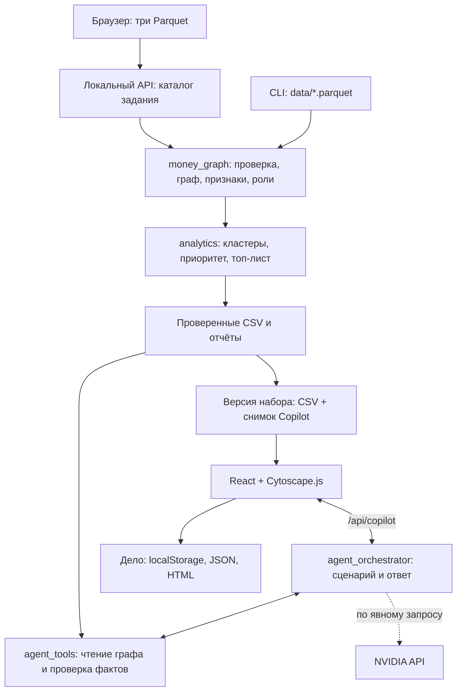

# HackAlem AI — «Граф денег»

**TayMas Solutions · рабочее место AML-аналитика для исследования сети переводов.**

Проект помогает специалисту по противодействию отмыванию денег (AML) разобраться в связях между клиентами: увидеть сбор и распределение средств, выбрать узлы для первоочередной проверки и сохранить основания своей гипотезы. На вход поступает обезличенная выгрузка внутрибанковских переводов; на выходе — граф, объяснимые роли клиентов, кластеры, очередь проверки и материалы расследования.

Роли и приоритеты рассчитываются локально по правилам и графовым признакам. Copilot помогает исследовать готовые результаты и показывает источники утверждений. Основной сценарий работает без внешней AI-модели и API-ключа.

> Результат анализа — гипотеза для дальнейшей проверки. Приоритет не является вероятностью нарушения, а проверка фактов по CSV не доказывает виновность клиента.

## Что реализовано

- **Обработка и проверка данных.** Загрузка трёх Parquet-файлов через браузер или CLI, проверка полей, типов, идентификаторов и согласованности сумм и количества операций между рёбрами и транзакциями. Новый набор становится активным после успешного расчёта; при ошибке предыдущий граф сохраняется.
- **Графовая аналитика.** Входящие и исходящие потоки, число контрагентов, PageRank, betweenness, HITS, достижимость, циклы длиной до пяти узлов и временная близость переводов.
- **Объяснимые роли.** Каждый узел получает роль, `role_score`, код правила и текстовое основание `evidence`.
- **Кластеры и очередь проверки.** Кластеризация Louvain с проверкой устойчивости, сводки по сообществам и топ-30 по `priority_score`. Вклад составляющих приоритета сохраняется в CSV.
- **Интерактивный граф.** Поиск по GID, фильтры по роли, кластеру, глубине и seed-статусу, просмотр соседей, направлений и сумм переводов, карточка клиента, режимы «Потоки» и «Сеть», окраска по роли или кластеру.
- **AML Investigation Copilot.** Объяснение роли и приоритета, поиск общего сборщика, обход связей вверх и вниз, предложение следующего шага. Структурированные факты сверяются с CSV на сервере и в браузере; узлы и связи из проверенного ответа подсвечиваются на графе.
- **План недостающих данных.** Панель «Каких данных не хватает?» предлагает запросить выписку, начальный остаток либо точное время операций и объясняет, как это поможет проверить гипотезу. План формируется локально; запросы в банк не отправляются.
- **Дело расследования.** Сохранение снимков узлов и ответов Copilot, гипотезы и заметок в браузере; импорт и экспорт JSON; экспорт HTML-справки для печати или сохранения в PDF средствами браузера. Снимки другой версии данных получают отдельную отметку.
- **Контроль результатов.** Проверки выходных таблиц, аудит топ-листа, отчёты о прогоне, SHA-256 файлов и повторный расчёт для проверки воспроизводимости.

В решении используются шесть ролей:

| Роль в CSV | Смысл гипотезы |
|---|---|
| `coordinator` | Координирует сбор и распределение средств |
| `consolidator` | Собирает средства от нескольких плательщиков |
| `distributor` | Распределяет средства множеству получателей |
| `transit` | Имеет признаки передачи поступивших средств дальше |
| `terminal` | Удерживает значительную долю видимых поступлений при наблюдаемом исходящем потоке |
| `peripheral` | Не достигает порогов других ролей либо имеет недостаточно наблюдаемых данных |

Пороги и порядок правил находятся в [money_graph/config.py](money_graph/config.py) и [money_graph/roles.py](money_graph/roles.py). `role_score` отражает силу правил, а не статистически откалиброванную вероятность.

## Как работает решение

1. Аналитик выбирает `nodes.parquet`, `edges.parquet` и `transactions.parquet` в браузере и нажимает **«Построить граф»**. Для отдельного CLI-прогона файлы размещаются в `data/`.
2. Python-пайплайн проверяет данные и строит направленный граф: клиент — узел, агрегированный перевод от плательщика к получателю — ребро.
3. Для узлов рассчитываются признаки и роли. Затем выделяются кластеры, рассчитываются приоритеты и формируется очередь проверки.
4. После проверки результатов API публикует новую версию CSV и снимок Copilot, а интерфейс открывает граф. Выбранные ранее GID и ответы сбрасываются; ручной перезапуск не нужен. CLI записывает результаты отдельно в `out/`.
5. Аналитик изучает карточку и связи, задаёт вопрос Copilot и сверяет основания ответа с указанными источниками в CSV.
6. Нужные узлы и ответы сохраняются в дело вместе с гипотезой, заметками и планом дальнейшей проверки. Материалы можно выгрузить в JSON или печатную справку.

| Файл результата | Содержание |
|---|---|
| `nodes_roles.csv` | Узлы, роли, `role_score`, кластеры, приоритеты, основания и признаки |
| `clusters.csv` | Размер кластеров, внутренний оборот, ключевые узлы и гипотезы |
| `top_nodes.csv` | Очередь проверки: `rank`, `gid`, `role`, `priority_score`, `why` |
| `edge_table.csv` | Направленные связи, суммы, число операций, даты и доли потоков |
| `run_report.md`, `run_report.json` | Проверки, предупреждения, время этапов, версии библиотек и хеши CSV |

Три обязательных CSV доступны по ссылкам **«Скачать CSV»** под формой загрузки. Браузерные версии хранятся в рабочем каталоге API, CLI-выгрузки — в `out/`; эти наборы не перезаписывают друг друга.

Формула приоритета учитывает сбор, рассылку, характер потока, связи с seed-клиентами, связи между кластерами и объём переводов. Для границы выгрузки применяется поправка. Подробности: [признаки](docs/features.md), [кластеры](docs/clustering.md), [приоритет](docs/priority.md), [топ-лист](docs/top_nodes.md).

## Технологии

| Слой | Технологии и назначение |
|---|---|
| Аналитика | Python 3.11+, pandas, NumPy, SciPy, PyArrow для Parquet, NetworkX `3.6.1` для графов |
| Интерфейс | TypeScript, React 19, Vite 7, Cytoscape.js, CSS |
| Локальный API | Стандартная библиотека Python: HTTP-сервер, JSON-контракты, инструменты чтения графа и верификатор |
| Опциональный AI | NVIDIA Chat Completions API с вызовом функций; HTTPS-клиент на стандартной библиотеке Python |
| Хранение | Parquet на входе, CSV и отчёты на выходе; `localStorage` для текущего дела, JSON и HTML для экспорта |
| Запуск | PowerShell/CMD, Bash, Docker Compose, nginx |
| Проверки | pytest; Vitest и Testing Library; Playwright для браузерных сценариев |

Зависимости: [requirements.txt](requirements.txt), [frontend/package.json](frontend/package.json), [frontend/package-lock.json](frontend/package-lock.json).

**AI-модель в коде не зафиксирована:** её идентификатор задаётся через `NVIDIA_MODEL`. Адаптер рассчитан на модель с поддержкой вызова функций. Обучения собственной модели в репозитории нет; роли, кластеры и приоритеты рассчитываются без LLM.

## Архитектура проекта



| Каталог | Ответственность |
|---|---|
| `money_graph/` | Основной пайплайн, роли, входные и выходные схемы, CLI, отчёты |
| `analytics/` | Кластеры, приоритеты, аудит топ-листа; дополнительные модули сравнения приоритетов и устойчивости графа |
| `agent_tools/` | Девять инструментов чтения готовых выгрузок, проверка утверждений и контрольные вопросы |
| `agent_orchestrator/` | Загрузка Parquet, версии наборов, HTTP API, маршрутизация вопроса, ограниченный план вызовов, сборка ответа и адаптер NVIDIA |
| `frontend/` | Граф, карточки, Copilot, план недостающих данных и дело расследования |
| `scripts/`, `deploy/` | Сценарии запуска, Docker-проверки и конфигурация nginx |
| `tests/`, `frontend/tests/`, `frontend/e2e/` | Тесты аналитики, контрактов, интерфейса и пользовательских сценариев |
| `docs/` | Подробное описание данных, алгоритмов, API и развёртывания |
| `starter/` | Стартовый код организаторов |

Браузер получает версии CSV через `/api/datasets/<dataset_id>/files/`; Vite и nginx проксируют запросы к локальному API. Copilot использует соответствующий снимок и не изменяет расчёты. Новый набор заменяет CSV и снимок только после успешной проверки; ответ другой версии не показывается на новом графе.

API сохраняет загруженные версии в `.money-graph/` при обычном запуске или в Docker volume `datasets`. При первом запуске без сохранённой версии он может импортировать готовый `out/`; последующий CLI-пересчёт не заменяет активную браузерную версию. Для её обновления загрузите файлы через форму. При недоступности API уже открытый граф, фильтры и карточки остаются доступны; новая загрузка и скачивание браузерных CSV требуют работающего API. Статический `out/` можно просматривать отдельно.

## Установка и запуск

### 1. Подготовьте окружение и данные

Для локального запуска нужны **Python 3.11+**, **Node.js 20.19+ или 22.12+** и npm. Для контейнерного варианта нужен Docker с Compose; Python и Node.js на хосте тогда не требуются. При первоначальной установке зависимостей или сборке образов нужен доступ к сети.

Откройте терминал в корне клонированного или распакованного проекта. Датасет организаторов распространяется отдельно: `data/`, `out/` и `.money-graph/` исключены из Git и Docker build context. Для загрузки через браузер распакуйте архив в любую папку — заранее создавать `data/` и рассчитывать `out/` не нужно. Для CLI и скриптов `run-all` разместите файлы так:

```text
data/
├── nodes.parquet
├── edges.parquet
└── transactions.parquet
```

### 2. Запустите приложение и загрузите файлы

Одна команда из корня репозитория для Docker Desktop / Docker Engine с Compose:

```bash
docker compose up --build
```

Откройте [http://127.0.0.1:8501](http://127.0.0.1:8501), выберите три файла и нажмите **«Построить граф»**. UI и API стартуют без `data/` и готового `out/`; отдельный batch-пайплайн не запускается. После расчёта доступны граф, карточки, топ-лист, скачивание трёх CSV и локальный Copilot без NVIDIA-ключа. **«Загрузить другой набор»** запускает новый анализ; ошибка не заменяет предыдущие результаты.

Лимит — **10 МиБ на файл, 32 МиБ на запрос**. Состояния загрузки, проверки и расчёта показываются отдельно; одновременно выполняется один расчёт. Неверный файл, повреждённый Parquet, ошибка схемы или превышение лимита дают сообщение для исправления ввода. ZIP нужно распаковать до выбора файлов. [Формат входа, ошибки и API](docs/uploads.md).

Для фонового запуска добавьте `-d`. Остановка: `docker compose down`. Загруженные файлы, CSV и активная версия сохраняются в именованном volume `datasets`; обычный `down` и пересборка его сохраняют. Не добавляйте `-v`, если хотите сохранить анализ. Старые версии автоматически не удаляются. API не публикуется отдельным портом: nginx передаёт `/api/*` внутри Docker. [Запуск и хранение](docs/deployment.md).

### Локальный запуск из готового `data/` без Docker

**Windows, PowerShell или CMD:**

```powershell
.\scripts\run-all.cmd -CheckRepro
```

**macOS / Linux:**

```bash
bash scripts/run-all.sh --check-repro
```

Скрипты создают `.venv` при необходимости, устанавливают недостающие зависимости, рассчитывают `out/`, запускают Copilot API и открывают интерфейс. Флаг проверки воспроизводимости запускает расчёт дважды и сравнивает SHA-256 четырёх CSV; без флага выполняется один расчёт.

- Интерфейс: [http://127.0.0.1:5173](http://127.0.0.1:5173).
- Статус Copilot: [http://127.0.0.1:8765/api/copilot/status](http://127.0.0.1:8765/api/copilot/status).
- Остановка: `Ctrl+C` в терминале запуска.

Скрипты используют уже подготовленный `data/`; после запуска новый набор можно загрузить через форму без перезапуска. Для просмотра статического `out/` без API предусмотрены `-NoCopilot` в Windows и `--no-copilot` в Bash; загрузка файлов в этом режиме недоступна. Vite проксирует API на порт `8765`, поэтому для обычного демо используйте этот порт.

### Ручной запуск отдельных компонентов

В первом терминале из корня проекта создайте окружение, установите зависимости, выполните расчёт и запустите API. На macOS системный `python3` может быть 3.9: явно выберите установленный Python 3.11 или новее. Для браузерной загрузки строку `-m money_graph` можно пропустить.

**Windows / PowerShell:**

```powershell
py -3 -m venv .venv
.\.venv\Scripts\python.exe -m pip install -r requirements.txt
.\.venv\Scripts\python.exe -m money_graph --data data --out out --check-repro
.\.venv\Scripts\python.exe -m agent_orchestrator.server --out out
```

**macOS / Linux:**

```bash
python3.11 -m venv .venv
.venv/bin/python -m pip install -r requirements.txt
.venv/bin/python -m money_graph --data data --out out --check-repro
.venv/bin/python -m agent_orchestrator.server --out out
```

Во втором терминале из корня проекта:

```bash
cd frontend
npm ci
npm run dev -- --host 127.0.0.1 --port 5173 --open
```

Для расчёта только CSV достаточно команды `-m money_graph`; API и интерфейс не нужны. Команда `npm run build` в `frontend/` собирает интерфейс и включает имеющиеся на момент сборки `out/*.csv` в `dist/out/`.

### Отдельный CLI/batch через Docker

Для воспроизводимости жюри распакуйте три файла в `data/`. На macOS/Linux из корня проекта:

```bash
bash scripts/docker-compose.sh run --build --rm pipeline
```

Обёртка создаёт `out/` и передаёт UID/GID текущего пользователя только batch-пайплайну для записи результатов на хосте. Copilot работает от UID 10001 и пишет в свой named volume. При прямом вызове Compose подготовьте права `out/` по [инструкции](docs/deployment.md#права-batch-выгрузок).

На Windows / PowerShell с Docker Desktop:

```powershell
New-Item -ItemType Directory -Force out | Out-Null
docker compose run --build --rm pipeline
```

Batch читает `data/` только для чтения, создаёт четыре CSV и отчёты в `out/`, выполняет `--check-repro`. Профиль `batch` не нужен для обычного запуска браузерного приложения. Этот отдельный прогон не заменяет уже активный загруженный набор. Настройка портов, каталогов и дополнительные проверки описаны в [docs/deployment.md](docs/deployment.md).

### Просмотр интерфейса без датасета

Запустите только frontend командами `npm ci` и `npm run dev` из `frontend/`. Если `out/` отсутствует, на экране ошибки нажмите **«Открыть демо-набор»**. Загрузятся небольшие синтетические CSV из `frontend/public/fixtures/`.

Этот режим позволяет посмотреть граф и интерфейс. Запросы Copilot в нём отключены; для полной проверки нужен датасет и результаты пайплайна.

### Опциональное подключение NVIDIA

Локальный Copilot работает без настройки провайдера. Для внешнего AI задайте `NVIDIA_API_KEY` и `NVIDIA_MODEL` в окружении процесса API. При запуске Docker Compose можно скопировать [.env.example](.env.example) в `.env` и заполнить оба значения локально. Обычный Python-запуск сам `.env` не читает.

После запуска настроенного API включите **«Использовать AI»** для нужного вопроса. В CLI этому соответствует флаг `--nvidia`. Наличие ключа само по себе не инициирует обращение к провайдеру. При ошибке, тайм-ауте или исчерпании квоты предусмотрен переход на проверенный локальный ответ.

Ключ хранится на серверной стороне. Состав передаваемых данных и роль модели описаны ниже и в [docs/agent_orchestrator.md](docs/agent_orchestrator.md).

## Как проверить решение

### Сценарий для жюри

1. **Запустите приложение и загрузите три Parquet через UI.** Дождитесь завершения анализа и проверьте ссылки на три CSV. Для отдельной проверки воспроизводимости выполните CLI с `--check-repro`: в `out/` появятся четыре CSV и отчёты, в `run_report.json` поле `reproducibility.identical` должно быть `true`.
2. **Откройте интерфейс.** Для набора, описанного в репозитории, ожидаются 2 248 узлов и 3 119 направленных связей. Источник чисел — [описание датасета](docs/DATA_README.md).
3. **Выберите первого клиента в очереди проверки.** Откройте карточку, изучите роль, приоритет, входящие и исходящие суммы. Найдите тот же GID в скачанных `top_nodes.csv` и `nodes_roles.csv` текущего набора: роль и приоритет должны совпасть с интерфейсом. Длинные GID сравнивайте как строки.
4. **Откройте Copilot.** Нажмите подсказку **«Почему этот узел в топе?»**, затем **«Разобрать вопрос»**, оставив внешний AI выключенным. В ответе должны быть факты с источниками и следующий шаг. Переход по GID открывает карточку; связи, если они присутствуют в ответе, подсвечиваются на графе.
5. **Проверьте границу данных.** Выберите фильтр глубины `4`, откройте любой узел и панель **«Каких данных не хватает?»** в Copilot. Она должна указать на ненаблюдаемые исходящие переводы и предложить запрос выписки. Отсутствие видимого оттока не должно превращаться в вывод о конечном получателе.
6. **Сохраните результат.** Нажмите **«Добавить узел в дело»** в карточке и **«Сохранить ответ в дело»** у ответа Copilot. Откройте значок папки слева, добавьте гипотезу и заметки, скачайте JSON и **«Печатную справку»**. После обновления страницы локальное дело должно сохраниться.

### Команды проверки

Для PR в `main` настроен [CI: Python, frontend и локальный Copilot](docs/ci.md).
Он использует отдельный синтетический Parquet; проверки на архиве организаторов остаются отдельной частью приёмки.

Следующие Python-команды выполняются из корня проекта интерпретатором `.venv`: замените `python` на `.\.venv\Scripts\python.exe` в Windows или `.venv/bin/python` в macOS/Linux.

```bash
python -m money_graph --data data --out out --check-repro
python -m agent_tools.evaluation --out out
python -m pytest tests -q
```

`agent_tools.evaluation` проверяет пять сценариев: приоритет, общий сборщик, входящие/исходящие связи, границу четвёртого колена и пустой результат. По умолчанию используется локальный эталонный ответчик; эта команда не измеряет качество внешней LLM. Тесты на реальном датасете пропускаются при отсутствии `data/`, при этом проверки на синтетических данных остаются доступны.

Проверки и сборка интерфейса:

```bash
cd frontend
npm test
npm run build
```

Браузерные тесты требуют работающих API, интерфейса и загруженного набора либо импортированного реального `out/`. Проверки загрузки и смены версии описаны в [docs/uploads.md](docs/uploads.md). Установите Chromium командой `npx playwright install chromium`, затем из `frontend/` укажите адрес запущенного UI.

**PowerShell:**

```powershell
$env:COPILOT_UI_URL = "http://127.0.0.1:5173"
npm run test:e2e
```

**Bash:**

```bash
COPILOT_UI_URL=http://127.0.0.1:5173 npm run test:e2e
```

Коды завершения CLI пайплайна: `0` — успех, `2` — ошибка входных данных, `3` — ошибка выходных таблиц, `4` — несовпадение файлов повторного расчёта. Время выполнения и результаты проверок следует брать из отчёта своего запуска.

## Данные и интеграции

**Исходный набор.** По [docs/DATA_README.md](docs/DATA_README.md), это обезличенный граф внутрибанковских переводов за **1–31 июля 2026 года**, построенный по исходящим переводам от **81 seed-клиента** до глубины **четырёх колен**, с порогом суммы **5 000 KZT**. Seed — исходные клиенты, от которых начинался обход.

| Файл | Объём описанного набора | Основные поля |
|---|---:|---|
| `nodes.parquet` | 2 248 узлов | `gid`, `depth`, `is_seed` |
| `edges.parquet` | 3 119 направленных пар | `src`, `dst`, `sum_kzt`, `n_tx`, `depth` |
| `transactions.parquet` | 4 840 транзакций | `src`, `dst`, `date`, `sum_kzt` |

Деньги измеряются в тенге (KZT), даты операций имеют точность до дня. GID — обезличенный идентификатор; в браузере он хранится строкой для сохранения точности длинных чисел. Схема проверяется в [money_graph/io.py](money_graph/io.py). Синтетический набор для просмотра интерфейса хранится отдельно в `frontend/public/fixtures/`.

**Локальный API.** `POST /api/datasets/jobs` принимает три Parquet, `GET /api/datasets/jobs/<job_id>` возвращает состояние расчёта, `GET /api/datasets/active` — активную версию. `GET /api/datasets/<dataset_id>/files/<file>` отдаёт CSV этой версии. `GET /api/copilot/status` сообщает готовность анализа, идентификатор набора и наличие настройки NVIDIA. `POST /api/copilot/answer` принимает вопрос, выбранные GID, глубину обхода и флаг использования AI. Источником фактов служат готовые CSV, доступные инструментам только для чтения.

**Внешний AI-сервис.** В адаптере задан endpoint `https://integrate.api.nvidia.com/v1/chat/completions`. При явном включении AI туда передаются вопрос, выбранные GID, допустимый план вызовов и ограниченный набор структурированных фактов. Полный датасет и свободные тексты `evidence`/`priority_why` из CSV не передаются. Модель выбирает акценты и следующий шаг из разрешённого набора; итоговое текстовое резюме формируется локально, ранжирование кандидатов не зависит от модели.

Подключений к банковской системе, внешним реестрам клиентов или сервису автоматической отправки запросов в текущем коде нет.

## Ограничения текущей версии

- **Неполный охват переводов.** Видны операции только в пределах периода, порога суммы и исходящего обхода. У узлов `depth=4` исходящие связи не выгружались; входящие от клиентов за пределами набора также не видны. Начальные остатки отсутствуют. Эти ограничения учитываются в признаках, правилах и предупреждениях.
- **Время не доказывает движение тех же денег.** Нет порядка операций внутри дня и сопоставления входящих сумм с конкретными исходящими переводами. Быстрый отток и циклы — признаки для проверки гипотезы.
- **Правила не обучены на размеченных нарушениях.** Пороги и веса заданы в коде; подтверждённых метрик обнаружения нарушений на размеченной выборке репозиторий не содержит. Проверка фактов Copilot подтверждает соответствие CSV и ограниченному формату ответа.
- **Copilot поддерживает ограниченный набор сценариев.** Вопрос — до 1 000 символов, контекст — до пяти GID, обход — до четырёх шагов. Нераспознанный вопрос возвращает сообщение об ограничении. Внешний AI требует настроенной модели, ключа, сети и доступной квоты.
- **Локальная работа со снимком.** Нет потокового обновления банковских данных. Браузер принимает три Parquet и автоматически переключает граф и Copilot после успешного анализа; CLI остаётся отдельным batch-сценарием. ZIP-импорт, очередь параллельных расчётов и автоматическое удаление старых наборов не реализованы.
- **Масштаб ограничен текущим подходом.** Граф и таблицы обрабатываются в памяти через NetworkX и pandas. Распределённая обработка не реализована. Лимит базового отображения графа в UI регулируется от 30 до 500 узлов; узлы из проверенного ответа могут добавляться сверх этого вида.
- **Дело хранится в браузере.** Нет серверного хранилища дел, учётных записей и совместного редактирования. Очистка локального хранилища удалит дело, если не сохранён JSON. Ограничения: 100 материалов на дело и до 4 000 000 байт для файла импорта. Подробности — в [docs/case_file.md](docs/case_file.md).
- **Развёртывание рассчитано на локальное демо.** В текущей конфигурации нет пользовательской аутентификации и TLS. Публичная эксплуатация требует отдельной настройки доступа и инфраструктуры.
- **Воспроизводимость проверяется в одном окружении.** `--check-repro` сравнивает два расчёта на одной машине; между версиями библиотек и платформами возможны различия. Версия NetworkX закреплена, остальные версии фиксируются в отчёте запуска.

## Развёрнутая версия

**Ссылка на публичную развёрнутую версию в репозитории не указана.** Для демонстрации предусмотрены локальные адреса [http://127.0.0.1:5173](http://127.0.0.1:5173) при запуске Vite и [http://127.0.0.1:8501](http://127.0.0.1:8501) при запуске Docker Compose.

Подробная инструкция: [docs/deployment.md](docs/deployment.md).
